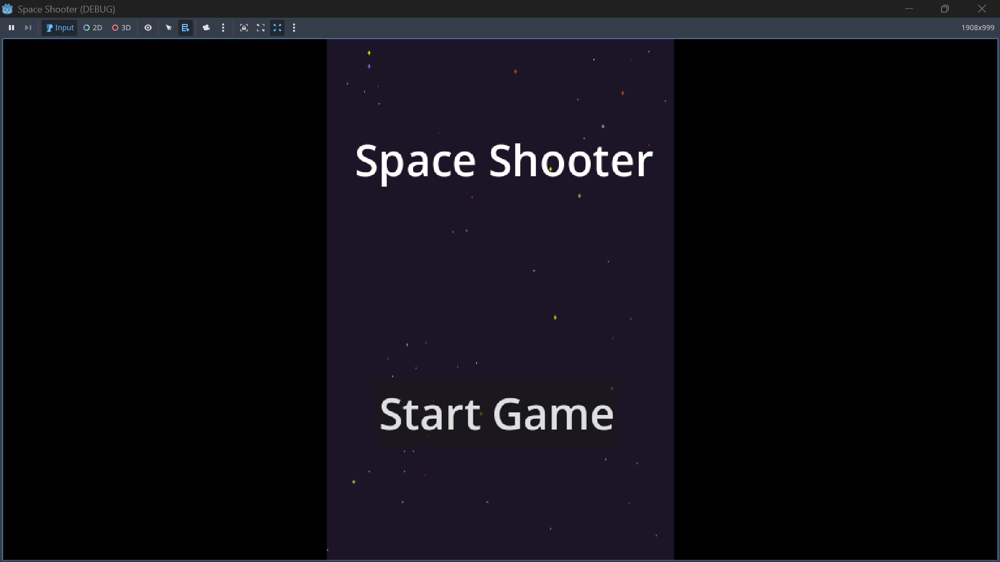
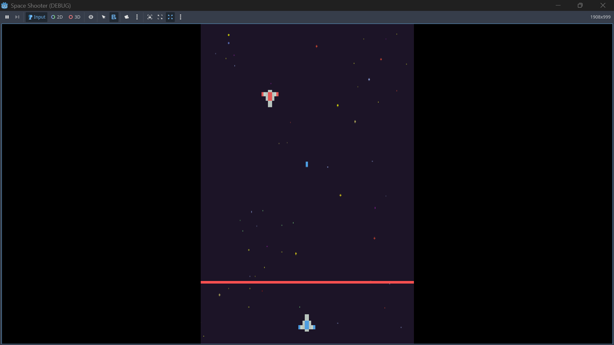

# 🚀 Space Shooter Game

A fast-paced 2D space shooter game made with the Godot Engine. You control a spaceship at the bottom of the screen and must destroy incoming enemy ships while avoiding letting them pass the red danger zone.

 <!-- Optional: replace with an actual image -->
 <!-- Optional: replace with an actual image -->

---

## 🎮 Gameplay Overview

- Control your spaceship using **arrow keys** or **touch slide** on mobile.
- Your spaceship **auto-fires bullets** every second.
- **Enemies spawn every 1.5 seconds** from the top and move downward.
- A **red line** at the bottom acts as a game over boundary — if any enemy crosses it, the game ends.
- A "Game Over" screen appears with a **Restart** button.
- Mobile-friendly with both **touch** and **keyboard** controls supported.

---

## 📱 Controls

| Action       | Input                         |
|--------------|-------------------------------|
| Move Left    | `←` Arrow Key / Slide Left    |
| Move Right   | `→` Arrow Key / Slide Right   |
| Shooting     | Auto-fire every 1s            |
| Restart Game | Restart button (after Game Over) |

---

## 🔊 Sound Effects

- Background music for immersive space environment  
- Shooting sound when bullets are fired  
- Explosion sound when enemies are hit  

*(All sounds are royalty-free and credited appropriately)*

---

## 🛠️ Built With

- **Engine:** [Godot Engine 4.x](https://godotengine.org/)
- **Language:** GDScript
- **Art & Audio:** OpenGameArt, Pixabay, Mixkit (linked in credits)

---

## 🧾 Features

- 🔁 Looping enemy spawn mechanism  
- 💥 Collision detection between bullets and enemies  
- 📱 Touch & Keyboard control support  
- 🎵 Sound integration  
- 🖼️ Game over and restart scenes  
- 🔧 Clean and modular Godot project structure  

---

## 📂 Project Structure

space-shooter-game/
├── assets/
│ ├── Musics/
│ └── *.png 
├── entities/
│ ├── bullet/
│ │ └── bullet.tscn
| | └── bullet.gd
│ └── enemies/
│ | └── enemy.tscn
| | └── enemy.gd
| └── enemy_spawner/
│ | └── enemy_spawner.gd
| └── player/
| | └── player.tscn
| | └── player.gd
├── scenes/
│ ├── GameOverScene/
| | └── game_over.tscn
| | └── restart_button.gd
│ └── MainScene/
| | └── Game.tscn
| | └── background_sound.gd
│ └── StartScene/
| | └── start_menu.tscn
| | └── startButton.gd
└── README.md

---

## 🚀 Getting Started

1. Download or clone the repo:
   ```bash
   git clone https://github.com/your-username/space-shooter-game.git

2. Open the project in Godot Engine

3. Run the scene: game_manager.tscn

---

## 📜 License

This project is licensed under the MIT License — feel free to use, modify, and distribute with credit.

---

## 🙌 Acknowledgments

- Godot Engine

- OpenGameArt

- Pixabay Sounds

- Mixkit
